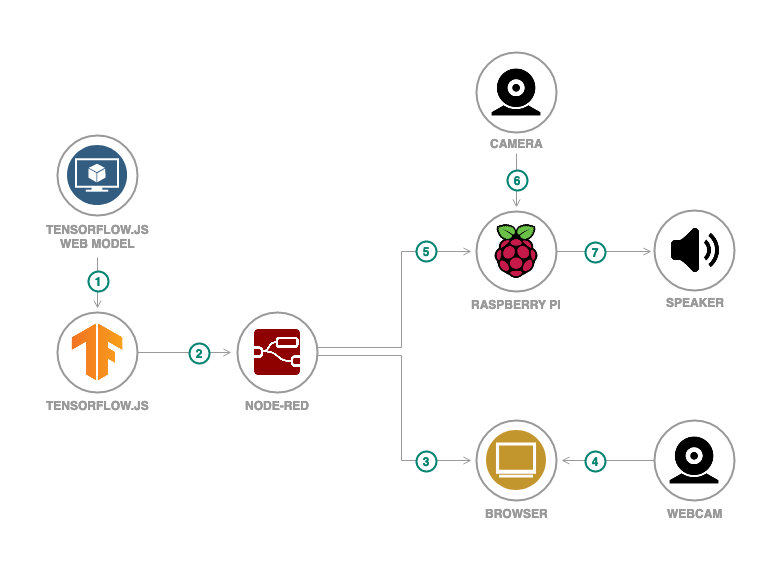
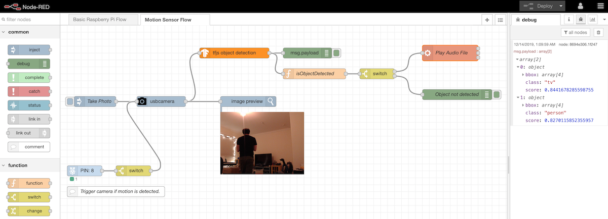
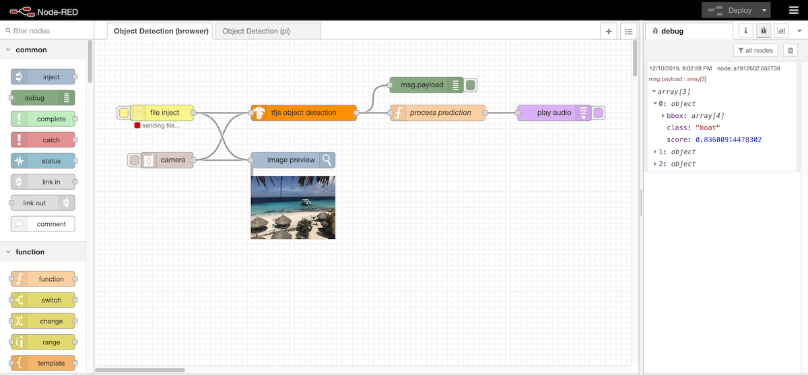

# Developing a Machine Learning IoT App with Node-RED and TensorFlow.js

In most cases, enabling your IoT device with AI capabilities involves sending the data from the device to a server. The machine learning calculations would happen on the server. Then the results sent back to the device for appropriate action.

When data security or network connectivity is a concern this is not an ideal or feasible approach.

With this code pattern, you will learn how to build and deploy machine learning apps that can run offline and directly on the device (in this case a Raspberry Pi). Using Node-RED with TensorFlow.js you can incorporate machine learning into your device is an easy, low-code way.

[Node-RED](https://nodered.org) is an open source visual programming tool that offers a browser-based flow editor for wiring together devices, APIs, and services. Built on Node.js, you can extend its features by creating your own nodes or taking advantage of the JavaScript and NPM ecosystem.

[TensorFlow.js](https://js.tensorflow.org) is an open source JavaScript library to build, train, and run machine learning models in JavaScript environments such as the browser and Node.js.

Combining Node-RED with TensorFlow.js  developers and IoT enthusiasts can more easily add machine learning functionality onto their devices.

When you have completed this code pattern, you will understand how to:

* Create a Node-RED node that includes a TensorFlow.js model
* Build and deploy a Node-RED application that uses a TensorFlow.js node





## Flow

1. The user owns or downloads a machine learning model in TensorFlow.js format
1. The user creates a Node-RED node for the TensorFlow.js model and wires the TensorFlow.js node in a Node-RED application
1. The use can deploy the Node-RED application locally
1. The uses access the Node-RED application from a browser and triggers inferencing on images captured from a webcam
1. Alternatively, the user can deploy the Node-RED application to a Raspberry Pi
1. The device runs the Node-RED application and performs inferencing on images from camera
1. The device can output to a connected speaker or take some other action depending on the inference results


## Included Components

- [Node-RED](https://nodered.org): A flow-based programming tool for wiring together hardware devices, APIs, and online services
- [TensorFlow.js](https://js.tensorflow.org): A JavaScript library for training and deploying ML models in the browser and on Node.js


## Featured Technologies

- Machine Learning
- IoT
- JavaScript / Node.js


## Steps

Follow these steps to setup and run this code pattern. The steps are described in detail below.

1. [Clone the repo](#clone-the-repo)
1. [Install the TensorFlow.js node](#install-the-tensorflowjs-node)
1. [Import the Node-RED flow](#import-the-node-red-flow)
1. [Deploy the Node-RED flow](#deploy-the-node-red-flow)

### Clone the repo

From a terminal run:

1. Clone the `node-red-tensorflowjs` repo
    ```
    $ git clone https://github.ibm.com/va/node-red-tensorflowjs
    ```

1. Take note of the directory of the cloned repo (e.g., `/Users/myuser/node-red-tensorflowjs`)
    ```
    $ cd node-red-tensorflowjs
    $ pwd
    ```

### Install the TensorFlow.js node 

Before running and using a TensorFlow.js model in a Node-RED application, a TensorFlow.js node will need to be created and installed to your Node-RED environment. From a terminal run:

1. Go into your Node-RED user directory (e.g., `~/.node-red`)
    ```
    $ cd ~/.node-red
    ```

1. Install the `node-red-contrib-tfjs-object-detection` node found in this repo (using the full directory path noted when the repo was clone)
    ```
    $ npm install <full path>/node-red-contrib-tfjs-object-detection
    ```

    > **NOTE**: _Currently, the installation of the `@tensorflow/tfjs-node` dependency [requires Python 2.7]((https://github.com/tensorflow/tfjs/tree/master/tfjs-node#windows--mac-os-x-requires-python-27)). Bindings will not properly install with Python 3.x._
    > 

If it is running, you will then need to restart Node-RED for the newly installed nodes to be recognized.

### Import the Node-RED flow

Once installed the node can be added and used in a flow of your Node-RED application. To import the flow available in this repo:

1. Start your Node-RED application
1. Open a browser and go to your Node-RED Editor
1. Click on the Node-RED Menu
1. Click on **Import**
1. Select the **Clipboard** tab
1. Click on **select a file to import**
1. Browse to and select the `flows.json` file in the cloned repo (e.g., `<full path>/flows/flows.json`)
1. Select **Import to new flow**
1. Click **Import**

### Deploy the Node-RED flow

The Node-RED flow can be deployed in multiple ways. Follow the options that best fits your use case:

- [Deploy to a Raspberry Pi](#deploy-to-a-raspberry-pi)
- [Run from a browser](#run-from-a-browser)

#### Deploy to a Raspberry Pi

##### Pre-requisites

- Raspberry Pi
- USB Camera
- USB Speakers

##### Deploy and run on Raspberry Pi

1. ...

#### Run from a browser

##### Pre-requisites

The browser flow uses custom nodes which need to be [added to the Palette Manager](https://nodered.org/docs/user-guide/runtime/adding-nodes):

- [`node-red-contrib-browser-utils`](https://flows.nodered.org/node/node-red-contrib-browser-utils)
- [`node-red-contrib-play-audio`](https://flows.nodered.org/node/node-red-contrib-play-audio)
- [`node-red-contrib-image-output`](https://flows.nodered.org/node/node-red-contrib-image-output)

##### Deploy and run locally

To run the application locally, from a terminal run:

1. Click the **Deploy** button
1. Upload or capture an image  
    a. Click the `file inject` node and browse to an image  
    b. Click the `camera` node and allow the browser to access the webcam

The image will be processed by the `tfjs object detection` node and the output will be displayed in the **Debug** panel. If the browser supports the Web Audio API the objects detected will be spoken.


## Output

#### Raspberry Pi flow



#### Browser flow




## Links

- [Node-RED](https://nodered.org)
- [TensorFlow.js](https://js.tensorflow.org)
- Bring Machine Learning to the Browser With TensorFlow.js - [Part I](https://medium.com/ibm-watson-data-lab/bring-machine-learning-to-the-browser-with-tensorflow-js-part-i-16924457291c), [Part II](https://medium.com/ibm-watson-data-lab/bring-machine-learning-to-the-browser-with-tensorflow-js-part-ii-7555ed9a999e), [Part III](https://medium.com/ibm-watson-data-lab/bring-machine-learning-to-the-browser-with-tensorflow-js-part-iii-62d2b09b10a3)
- [Optimize your visual recognition classification](https://developer.ibm.com/components/node-red/patterns/optimize-visual-recognition-classification)
- [TensorFlow.js and Node-RED: The Low-Code Approach to ML Apps for IoT](https://ibm.biz/tfjs-nodered)
- [Creating Custom Node-RED Nodes for your API: The Easy Way](https://medium.com/codait/creating-custom-node-red-nodes-for-your-api-the-easy-way-10770ccd8923)
- [Node-RED Nodes for Machine Learning with TensorFlow.js](https://github.com/vabarbosa/tfjs-node-red)
- [Node-RED modules for TensorFlow.js](https://github.com/tonanhngo/nodered-tfjs)
- [Node-Red custom node for DeepSpeech2](https://github.com/yhwang/node-red-contrib-ds2-tfjs)
- [Pretrained models for TensorFlow.js](https://github.com/tensorflow/tfjs-models)


## License

This code pattern is licensed under the Apache License, Version 2. Separate third-party code objects invoked within this code pattern are licensed by their respective providers pursuant to their own separate licenses. Contributions are subject to the [Developer Certificate of Origin, Version 1.1](https://developercertificate.org/) and the [Apache License, Version 2](https://www.apache.org/licenses/LICENSE-2.0.txt).

[Apache License FAQ](https://www.apache.org/foundation/license-faq.html#WhatDoesItMEAN)
